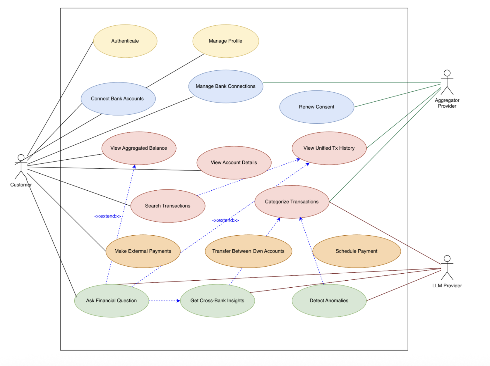

# 1. Problem Statement

Most people do not bank with one institution. A typical European retail customer has a current account at one bank, a savings or Tagesgeld account at another, one or two credit cards from different issuers, possibly a neobank (N26, Revolut) used for travel, and increasingly an investment or broker account (Trade Republic, Scalable, ING). In Germany, this fragmentation is the norm rather than the exception; partly historical (Sparkassen + Direktbanken), partly rational (people chase interest rates, low fees, FX-friendly cards). 

The cost of this fragmentation is paid in user attention:

* **No single source of truth.** A simple question like "how much money do I actually have?" has no answer without opening four apps and adding up the numbers manually. Net worth, total monthly outflows, and category-level spending across all accounts are invisible by default.
* **Login fatigue and context switching.** Each bank app has its own authentication, UI conventions, search behavior, and mental model. Users either consolidate poorly (only ever look at one account) or build private spreadsheets that are out of date by the next paycheck.
* **Reconciliation is manual.** "Did I pay that invoice?" requires guessing which account it came from before searching. "Where did this €47 charge come from?" Same problem in reverse. Banks expose their own data well; nobody exposes the user's data well.
* **Cross-account decisions are unsupported.** "Should I move money from savings to current to avoid an overdraft?" "Which of my cards has the best FX rate for this trip?" "Am I keeping too much in zero-interest checking?" The answers exist in the data but not in any one bank's app, because no bank has an incentive to point you at a competitor's product.

The Banking Assistant addresses fragmentation directly: it aggregates all of a user's accounts into a single conversational interface, normalizes their data into a consistent format, and uses GenAI to answer questions that span institutions. This is legally possible in the EU under PSD2/Open Banking, which obliges banks to expose customer-authorized account data via standardized APIs. The aggregator model is the foundation; conversational AI is what makes the aggregated data actually useful.

## Main Functionality
* **Unified account inquiry.** Users ask conversational questions that span accounts: "How much do I have in total?", "What's in my N26?", "How much across my savings accounts?" The assistant resolves which account(s) the question refers to, queries them, and presents a consolidated answer.
* **Normalized transaction reasoning.** The assistant stores transactions from all connected institutions in a single normalized schema (amount, currency, counterparty, category, timestamp, source account, raw payload). This is what makes cross-bank queries tractable: "how much did I spend on groceries last month, total?" aggregates across the Sparkasse current account, the DKB credit card, and the Revolut card without the user having to know that.
* **Cross-account payment drafting and execution.** Two kinds of payments matter here. Internal movements between the user's own connected accounts (move €500 from savings to current). External payments to third parties (send Anna €25). Both are drafted by the assistant from natural-language descriptions, but executed only after explicit user confirmation. External payments use PSD2 Payment Initiation (PISP) where available, falling back to deep-linking into the bank's own app where it is not.
* **Cross-bank insights.** Categorized spending across all accounts, anomaly detection that uses the user's full baseline rather than per-account baselines, and forward-looking questions ("can I afford X?") that account for the user's true total liquidity rather than a single account's balance.

## Intended Users
The product targets retail customers who already maintain accounts at two or more institutions, which, in the German and broader EU market, is the majority of working-age adults. Three sub-segments where the value is sharpest:
1. **Multi-bank everyday users** - the most common profile. A current account at Sparkasse or a Volksbank, a savings account at a Direktbank for a better interest rate, and a neobank or credit card for travel. Today, they manage this by switching between three apps; the assistant consolidates them into a single interface.
2. **Financially active users** who actively optimize across products chasing Tagesgeld rates, using specific cards for FX, parking cash in money-market funds. They benefit most from cross-account insights because they have the most accounts to manage.
3. **Couples and shared-finance households** managing joint plus individual accounts across institutions. (Multi-user shared views are a v2 feature; the MVP serves the individual within such a household.)

## How GenAI Is Meaningfully Integrated
The aggregator framing makes the GenAI integration more meaningful, not less, because every problem GenAI solves becomes harder and more valuable when data comes from multiple, inconsistent sources.

**What GenAI deliberately does not do:** It does not store credentials. It does not bypass PSD2 consent. It does not execute payments it drafts them. It does not enforce authorization - the Spring backend does, on every tool call, scoped to the user's own consents. A prompt-injection attack against the agent layer cannot, by construction, exceed what the user has consented to share, because every tool call is re-authorized by the backend using the user's JWT and their on-file PSD2 consents.

### Scenarios
* **Scenario 1 - The "where am I, financially?" question.** Maria opens the assistant on Sunday morning and asks, "how am I doing this month?" The assistant queries her four connected accounts (Sparkasse current, DKB credit card, Trade Republic cash, N26 travel), aggregates inflows and outflows, and answers: "Across all accounts, you've spent €1,840 and earned €3,200 so far in April, leaving you €1,360 net positive. Your total liquid balance is €11,420 - €4,200 in current accounts, €6,800 in savings, €420 on N26. Your spending is on track with March." No single bank's app could produce this answer.
* **Scenario 2 - Cross-account reconciliation.** Yusuf sees a €74 charge on his statement and doesn't recognize it. He asks, "What was the €74 charge a few days ago?" The assistant searches across all four connected accounts, finds it on the DKB credit card from Tuesday, identifies the merchant as a restaurant in Berlin, and shows him the entry. Without aggregation, he would have had to log into each bank to find it.
* **Scenario 3 - Smart payment routing.** Lena wants to pay a €600 invoice. She types "pay this €600 invoice - IBAN DE89..." The Payment Agent notices her current account has €450, and her savings account at a different bank has €5,000. It drafts a two-step plan: an internal transfer of €200 from savings to current, followed by an external payment of €600 from current. The UI presents both steps for confirmation. Lena could have done this manually across two apps - but didn't have to.

# 2. System Overview -> Architecture

## 1.1 Technical Division
The system is split into four cooperating tiers, each with a single responsibility and a clean contract toward its neighbors. This separation is what makes the DevOps lifecycle (independent CI pipelines, independent deployability, isolated scaling, isolated failure domains) practical later on.

* **Client: React (TypeScript)** The web frontend handles authentication flows, renders the chat interface, and visualizes account/transaction data. State is managed with React Query for server state and Zustand (or Redux Toolkit) for UI state. Communication with the backend is REST + Server-Sent Events (SSE) for streaming AI responses token-by-token. React was chosen over Angular/Vue for the size of its ecosystem around streaming UIs (ai-sdk, react-markdown) and easier hiring.
* **Server: Spring Boot REST API (Java 17)** The backend is the system of record and the security perimeter. It owns:
  * Authentication & session management (JWT + refresh tokens, OAuth2 ready).
  * All banking domain logic accounts, transactions, payments, idempotency keys, audit trail.
  * Authorization enforcement: every read or write to user data passes through here, never directly from the GenAI service to the database.
  * Orchestrating calls to the GenAI service for conversational requests.
  
  Spring Boot is chosen for the maturity of its security stack (Spring Security, Spring Data JPA), strong typing for financial calculations (BigDecimal), and operational tooling (Actuator, Micrometer).
* **GenAI Service:** Python / FastAPI service that hosts the agent orchestration layer. It communicates with a local Ollama instance (llama3.1:8b) as the LLM provider, keeping inference on-premises without a dependency on an external cloud LLM API.
* **Database:** PostgreSQL 16 (containerized). PostgreSQL for the transactional core (ACID guarantees are non-negotiable for payments). In the current setup the database runs as a Docker container (StatefulSet in Kubernetes), rather than a managed cloud instance.

## 1.2 Analysis Object Model (UML Class Diagram)

## 1.3 Use Case Diagram

## 1.4 Top-Level Architecture (UML Component Diagram)

# 3. First Product Backlog
1. As a user, I want to securely create an account and log in, so that my financial data is protected and only accessible to me
2. As a user, I want to connect one or more bank accounts via PSD2/Open Banking, so that I can access my financial data in one place
3. As a user, I want to see a list of all my connected accounts with their balances, so that I have a quick overview of my finances
4. As a user, I want to see my transactions from all connected accounts in a unified list, so that I don't need to check multiple banking apps
5. As a user, I want transactions to be normalized into a consistent format (amount, date, category, account), so that they are comparable across banks
6. As a user, I want to ask simple questions like "How much money do I have in total?", so that I can quickly understand my overall financial situation
7. As a user, I want to ask questions about spending (e.g., "How much did I spend last month?"), so that I can track my expenses across all accounts
8. As a user, I want transactions to be automatically categorized (e.g., groceries, rent, travel), so that I can understand where my money goes
9. As a user, I want to see aggregated spending per category across all accounts, so that I get a complete picture of my habits
10. As a user, I want to search for a specific transaction (e.g., "€47 charge"), so that I can quickly find and identify payments
11. As a user, I want to ask the assistant about a specific transaction, so that I can understand what it was and where it came from
12. As a user, I want to initiate internal transfers between my own accounts, so that I can move money without switching apps
13. As a user, I want to draft payments to other people via natural language (e.g., "send Anna €25"), so that payments are faster and easier
14. As a user, I want to review and confirm any payment before execution, so that I stay in full control of my money
15. As a user, I want to receive insights about my finances (e.g., unusual spending or monthly summaries), so that I can make better decisions
16. As a user, I want the assistant to answer cross-account questions (e.g., "Can I afford €600?"), so that I can make informed financial decisions
17. As a user, I want my data and permissions to be managed securely (consents, tokens), so that I trust the system with my financial data
